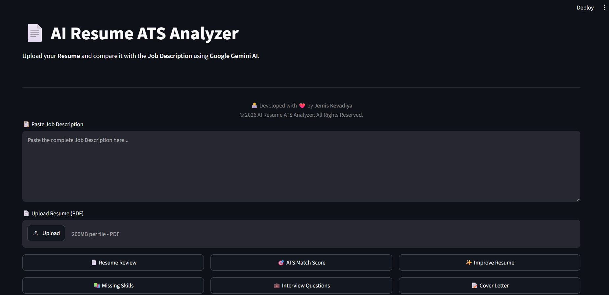
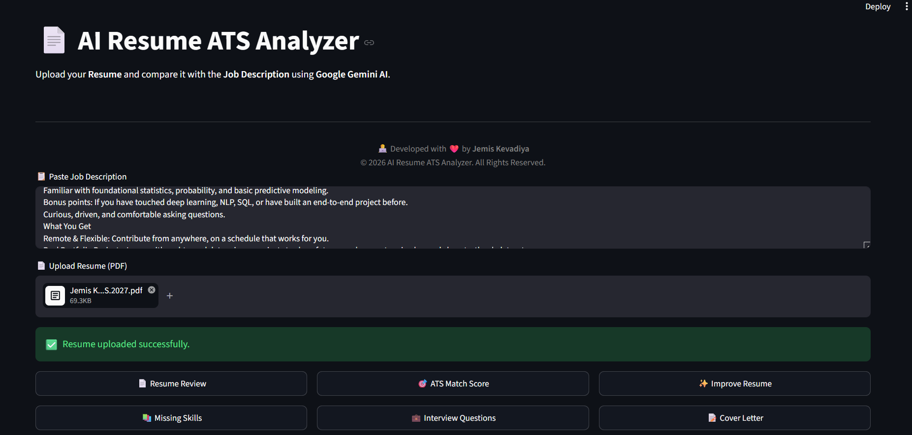
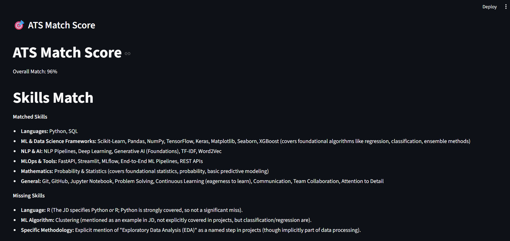

# 📄 AI Resume ATS Analyzer

<div align="center">

### 🤖 AI-Powered Resume Screening using Google Gemini AI

Analyze your resume against any job description, calculate ATS compatibility, identify missing skills, generate interview questions, create tailored cover letters, and rewrite resumes using Google's Gemini AI.

---


</div>

---

# ✨ Features

* 📄 Resume Review
* 🎯 ATS Match Score
* 📚 Missing Skills Detection
* ✨ Resume Improvement Suggestions
* 💼 AI Interview Questions
* 📝 AI Cover Letter Generator
* 🖋 Resume Rewrite
* 📄 PDF Resume Upload
* ⚡ Google Gemini 2.5 Flash Integration
* 🎨 Modern Streamlit Interface

---

# 📸 Application Screenshots

## 🎥 Application Demo

<p align="center">
  <video src="screenshots/demo.mp4" controls width="100%"></video>
</p>

---

## 🏠 Home Page

<p align="center">

</p>

---

## 📄 Resume Uploaded

<p align="center">

</p>

---

## 🎯 ATS Match Score

<p align="center">

</p>

---

## 💼 AI Interview Questions

<p align="center">

</p>

---

# 🏗 Project Structure

```text
AI-Resume-ATS-Analyzer/
│
├── app.py
├── prompts.py
├── requirements.txt
├── README.md
├── .env
│
├── config/
│   ├── settings.py
│   └── __init__.py
│
├── services/
│   ├── analysis_service.py
│   ├── gemini_service.py
│   ├── pdf_service.py
│   └── __init__.py
│
├── ui/
│   ├── layout.py
│   ├── buttons.py
│   └── __init__.py
│
└── screenshots/
```

---

# ⚙️ Tech Stack

| Category       | Technology              |
| -------------- | ----------------------- |
| Language       | Python                  |
| Frontend       | Streamlit               |
| AI Model       | Google Gemini 2.5 Flash |
| PDF Processing | PyPDF2                  |
| Environment    | python-dotenv           |

---

# 🚀 Installation

## Clone Repository

```bash
git clone https://github.com/YOUR_USERNAME/AI-Resume-ATS-Analyzer.git

cd AI-Resume-ATS-Analyzer
```

## Create Virtual Environment

### Windows

```bash
python -m venv venv

venv\Scripts\activate
```

### Linux / macOS

```bash
python3 -m venv venv

source venv/bin/activate
```

## Install Requirements

```bash
pip install -r requirements.txt
```

---

# 🔑 Environment Variables

Create a `.env` file.

```env
GOOGLE_API_KEY=YOUR_GEMINI_API_KEY
```

---

# ▶️ Run Application

```bash
streamlit run app.py
```

---

# 🧠 AI Workflow

```text
Resume PDF
      │
      ▼
Extract Resume Text
      │
      ▼
Job Description
      │
      ▼
Google Gemini AI
      │
      ▼
Resume Analysis
      │
      ├── ATS Match Score
      ├── Resume Review
      ├── Missing Skills
      ├── Resume Rewrite
      ├── Interview Questions
      └── Cover Letter
```

---

# 💡 Key Features

### 📄 Resume Review

Provides detailed AI feedback on resume quality.

### 🎯 ATS Match Score

Calculates compatibility with the target job.

### 📚 Missing Skills

Identifies skills absent from the resume.

### ✨ Resume Improvement

Suggests actionable improvements.

### 💼 Interview Questions

Generates role-specific interview questions.

### 📝 Cover Letter

Creates an AI-generated personalized cover letter.

### 🖋 Resume Rewrite

Rewrites the resume with stronger, ATS-friendly content.

---

# 📈 Future Improvements

* Multi Resume Comparison
* Resume Ranking
* DOCX Support
* Export Results as PDF
* Resume History
* Authentication
* Recruiter Dashboard
* Job Recommendation Engine

---

# 💻 Skills Demonstrated

* Python
* Streamlit
* Google Gemini API
* Prompt Engineering
* Modular Architecture
* PDF Processing
* Environment Variables
* AI Application Development

---

# 👨‍💻 Developer

## Jemis Kevadiya

**B.Tech – Artificial Intelligence & Data Science**

Passionate about Artificial Intelligence, Machine Learning, Deep Learning, NLP, and Generative AI.

### Connect

* GitHub: https://github.com/JemisKevadiya
* LinkedIn: https://www.linkedin.com/in/jemis-kevadiya-a0b3b9312/
* Email: *Add Your Email*

---

# ⭐ Support

If you found this project useful:

⭐ Star this repository

🍴 Fork the repository

💬 Share your feedback

---

<div align="center">

### 🚀 Built with ❤️ by Jemis Kevadiya

</div>
